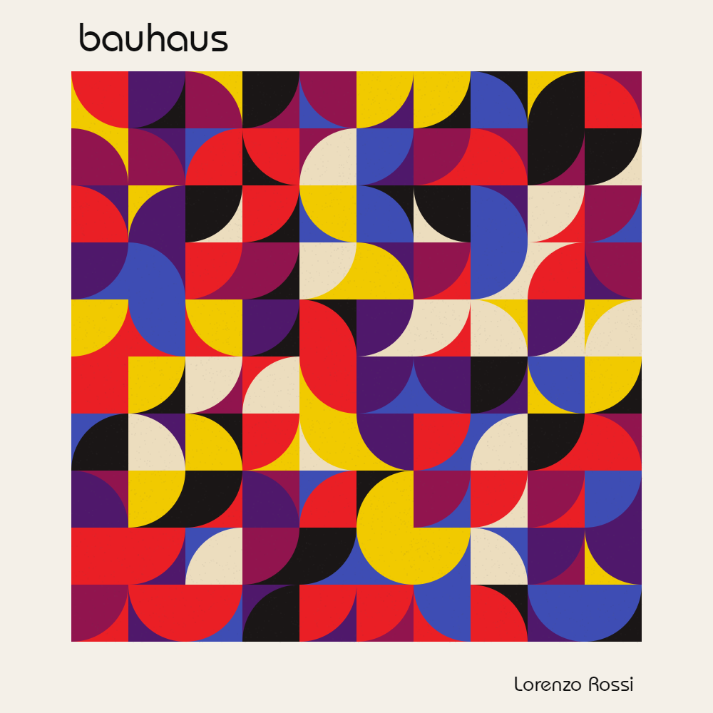
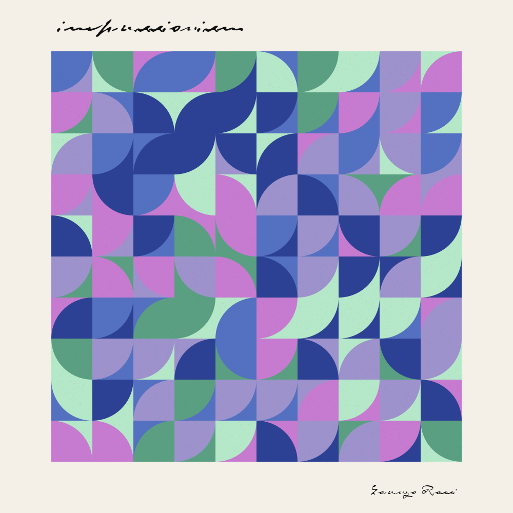
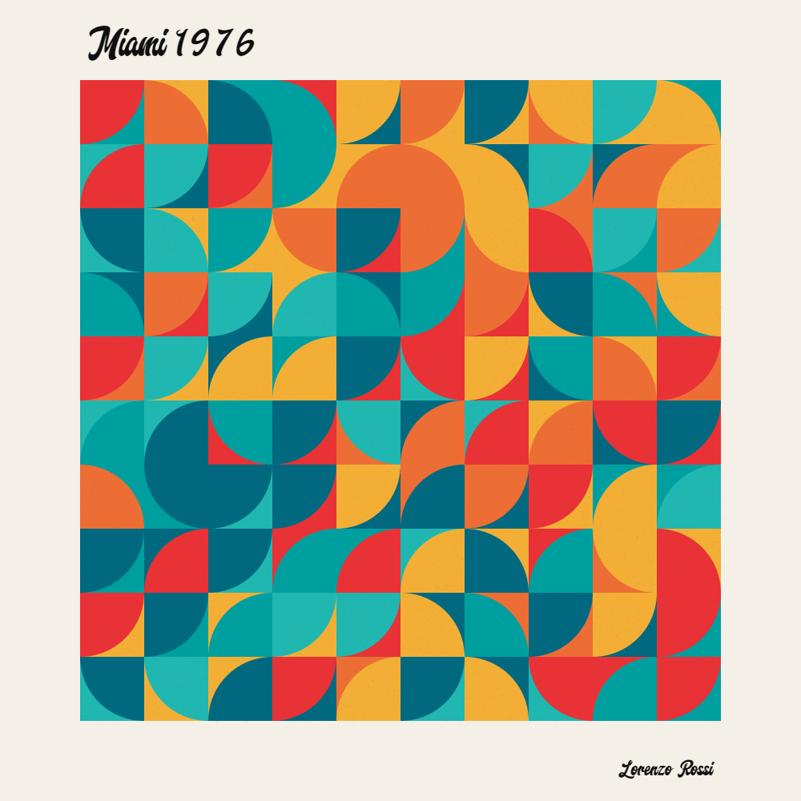
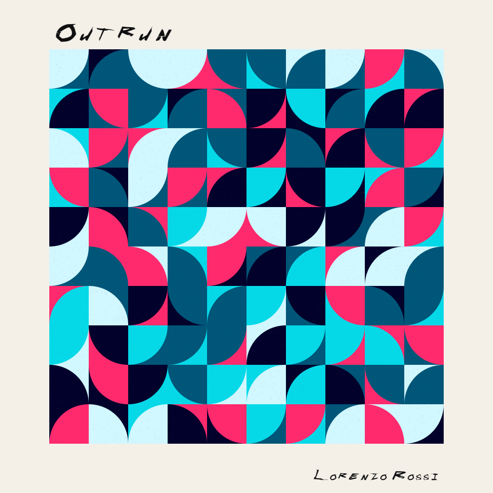
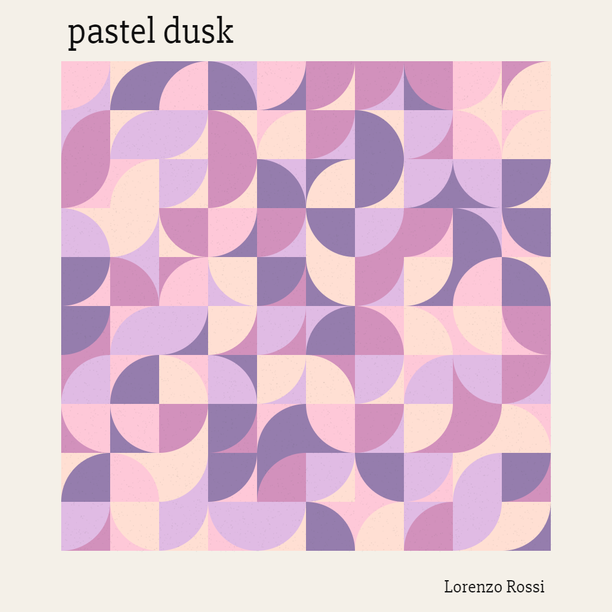
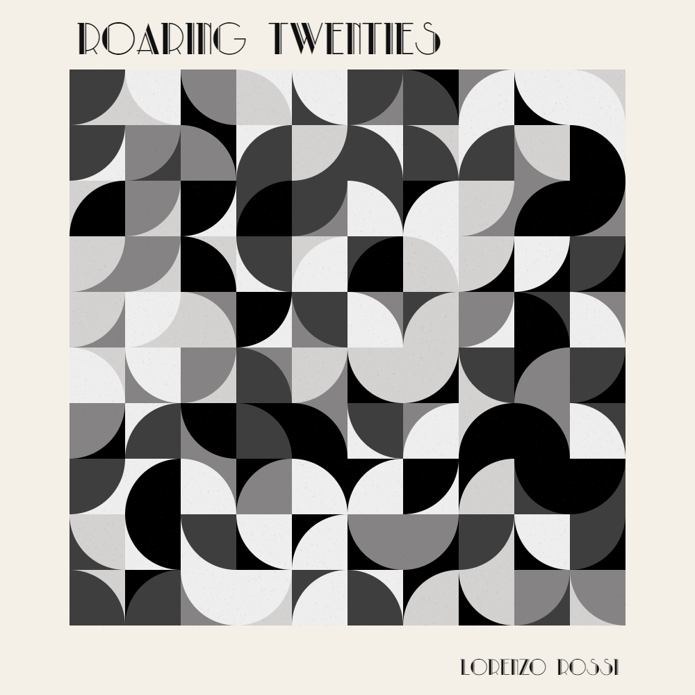
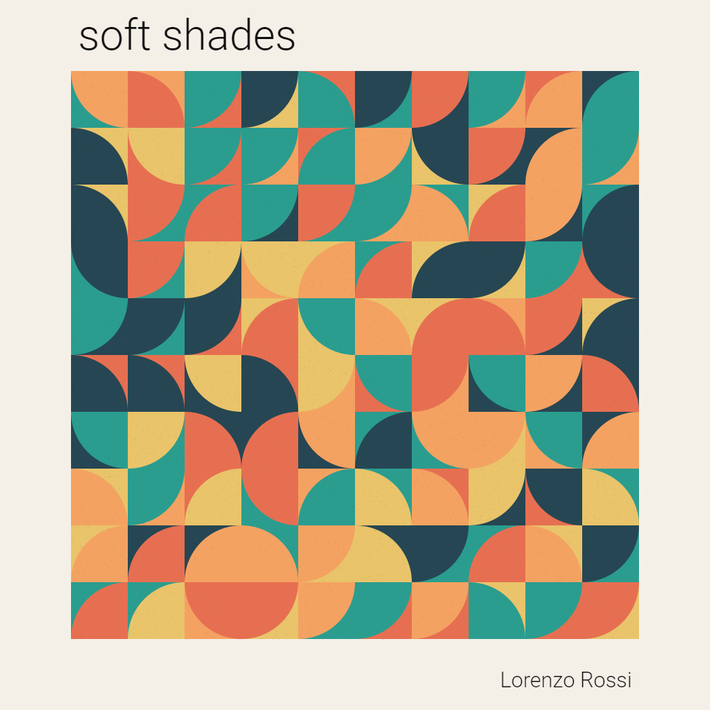
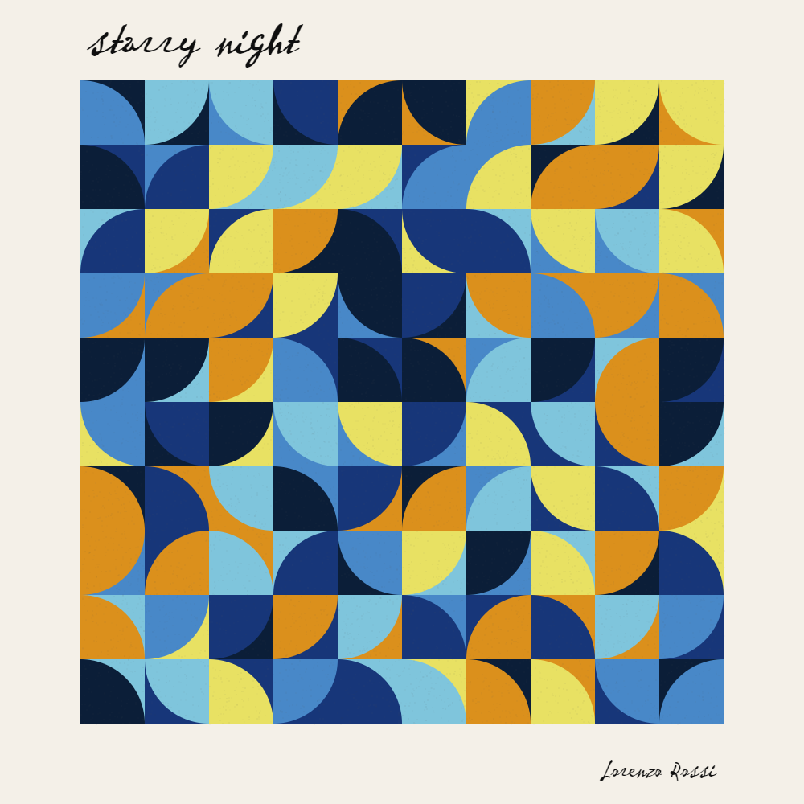

# Circle tiling

There's really not much I can say about this. I like tiling, I like art, I like coding.

Wouldn't you say?

If I were an artist, I would call this *Study on circular plane tiling*. Too bad I'm not, so I called it *circle tiling*. Way less pretentious, too.

## Try it here [lorenzoros.si/circle-tiling](https://www.lorenzoros.si/circle-tiling)

View more of my work on my [website](https://www.lorenzoros.si) or on my [Instagram profile](https://www.instagram.com/lorossi97)

## Some background

So, basically, you can fill ANY surface with a square. Neat! You can also fit quarter of a circle inside a square, leaving only some border to be seen. So this script basically generates a lot of square and fills them with arches.

The colors are picked from a 9 palettes, and to each palette is associated a different font that, in my opinion, best represented the palette itself. Additionally, after everything is renderd, a huge amount of particles are added to the main canvas, giving it a little "old and precious" feel, to texturize a little bit and give some depth to the final product.

Do you like a painting? Click `download image` to save it and keep it forever!

## Output images

Below each image you will find a small description of it and How the colors are picked.

**Bauhaus 1/9**:

- Bauhaus, mimicking the colors most commonly used in the Bauhaus school of design. I sourced the colors from the official Bauhaus website.

**Impressionism 2/9**:

- Impressionism, with the color sampled from Manet's lilypads. It's one of the most beautiful paintings ever, I felt like I was missing something by not including it.

**Miami 1976 3/9**:

- Miami 1976, this is a bit far fetched. I picked some colors that looked like a picture from a sunny day in Miami, 1976. Drugs not included, of course. Keep it family friendly.

**Outrun 4/9**:

- Outrun, because how could I miss this? Futuristic palms and cars, in a more concise and abstract way of course. This canvas also runs better (and it's less bugged) than that overhyped game.

**Pastel dusk 5/9**:

- Pastel dusk, because... why not. There's not always a because, right? I like pastel colors and I picked this palette from a photo of the dusk. I think it's pretty cute, but maybe a little bit too faded. All considered, it's very relaxing.

**Pop art 6/9**:

- Pop art. I can't deny that Andy Warhol has impacted me and shaped my imagination. This is a tribute for all the art from the Pop art movement.

**Roaring twenties 7/9**:

- Roaring twenties, a monochrome palette chosen to imitate the feel and looks of the 20s classic films. You'll have to bring the swing, it's not included. Don't forget to take some lindy-hop lessons beforehand.

**Soft shades 7/9**:

- Soft shades. Even for this, I just liked the color. I sourced them from [day 23 of Genuary](https://genuary2021.github.io/prompts) and tweaked them a little bit.

**Starry nights 8/9**:

- Van Gogh, one of my favourite painters. I have always loved his unique style, I got impressed when I saw his museum. How could I not include him in my small project? The colors are sampled from one of his most known paintings, Starry Night.

## Credits

This project is distributed under Attribution 4.0 International (CC BY 4.0) license.
